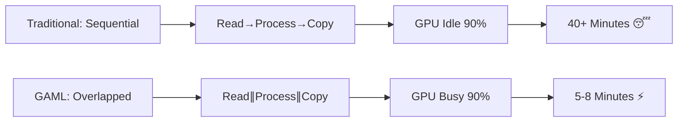

# 🚀 GAML - GPU-Accelerated Model Loading

**Finally fix the 40-minute model loading bottleneck!**

GAML accelerates GGUF model loading using GPU parallel processing instead of slow CPU sequential operations. Load 70B models in **5-8 minutes** instead of 40+ minutes.

**Fund Development!** <a href="https://www.buymeacoffee.com/caseytunturi" target="_blank"></a>

## 🎯 The Problem

Current GGUF loaders (Ollama, llama.cpp) are **pipeline-bound disasters**:
- Sequential processing of billions of quantized weights
- GPU idle 90% of the time while CPU struggles
- 40+ minutes to load large models (70B Q4_K)
- Terrible user experience for local AI

## ⚡ GAML Solution

**Overlapped GPU Pipeline**:
- Triple-buffered async processing
- Pinned memory + CUDA streams
- GPU busy while next chunk loads from disk
- 5-20x speedup vs CPU-only loading
- Bit-perfect accuracy guarantee

## 🏗️ Current Status: Complete Pipeline (v0.2)

**Phase 1 Complete**: Q4_K Dequantization Kernel ✅
- ✅ CUDA kernel for Q4_K quantized weights
- ✅ Parallel processing across GPU cores  
- ✅ Performance benchmarking vs CPU
- ✅ Accuracy verification

**Phase 2 Complete**: Full Loading Pipeline ✅
- ✅ GGUF file format parser
- ✅ Async triple-buffered loading system
- ✅ GPU memory management with streams
- ✅ Production CLI tool (`gaml`)
- ✅ Context-aware memory planning
- ✅ KV cache size estimation
- ✅ RAM usage warnings and optimization

**Next Phases**:
- 🔄 Multi-format support (Q8_0, F16)
- 🔄 Advanced optimizations
- 🔄 Cross-platform GPU support
- 🔄 Integration with existing tools

## ⚡ New Feature: Context-Aware Memory Planning

GAML now includes intelligent memory planning that calculates exact RAM requirements:

```bash
./gaml --ctx 2048 model.gguf   # ~23GB RAM for 19GB model
./gaml --ctx 1024 model.gguf   # ~21GB RAM for 19GB model
./gaml --ctx 512 model.gguf    # ~20GB RAM for 19GB model
```

**Memory breakdown shown before loading:**
- Model weights: 19,016 MB
- KV cache (ctx=2048): 3,472 MB  
- Estimated total: 23,000 MB
- ⚠️ Warning if insufficient RAM

## 🔧 Quick Start

### Option 1: Docker Build (Recommended)
Perfect for systems with nvidia-container-toolkit but no CUDA dev tools:

```bash
git clone https://github.com/Fimeg/GAML.git
cd GAML
./docker-build.sh

# Test GPU compatibility
docker run --rm --privileged --gpus all \
  -v /usr/local/cuda-11.8:/usr/local/cuda-11.8:ro \
  -v /dev:/dev -v $(pwd):/host gaml-dev \
  bash -c 'cd /host && ./gaml --gpu-info'

# Process a model with context length control
docker run --rm --privileged --gpus all \
  -v /usr/local/cuda-11.8:/usr/local/cuda-11.8:ro \
  -v /dev:/dev -v $(pwd):/host gaml-dev \
  bash -c 'cd /host && ./gaml --ctx 2048 model.gguf'

# Run benchmark
docker run --rm --privileged --gpus all \
  -v /usr/local/cuda-11.8:/usr/local/cuda-11.8:ro \
  -v /dev:/dev -v $(pwd):/host gaml-dev \
  bash -c 'cd /host && ./gaml --benchmark'
```

### Option 2: Native Build
For systems with full CUDA toolkit installed:

```bash
# Prerequisites: CUDA Toolkit 11.0+
sudo dnf install nvidia-cuda-toolkit  # Fedora
# OR
sudo apt install nvidia-cuda-toolkit  # Ubuntu/Debian

git clone https://github.com/Fimeg/GAML.git
cd GAML
make check-cuda    # Verify CUDA installation
make              # Build complete GAML tool
make test-gpu     # Check GPU compatibility
./gaml --help     # See usage options
```

### Process a Model
```bash
# Basic usage with 2K context (memory efficient)
./gaml --ctx 2048 model.gguf

# Higher context for larger conversations
./gaml --ctx 4096 model.gguf

# Save processed tensors
./gaml --ctx 2048 model.gguf output/

# Custom chunk size with context control
./gaml -c 512MB --ctx 2048 model.gguf

# Check memory requirements before loading
./gaml --ctx 1024 model.gguf  # Lower memory usage

# Run benchmark
./gaml --benchmark
```

## 🎮 GPU Compatibility

**NVIDIA (Primary Target)**:
- GTX 1060, 1070, 1080 series ✅
- RTX 2060, 2070, 2080 series ✅  
- RTX 3060, 3070, 3080, 3090 series ✅
- RTX 4060, 4070, 4080, 4090 series ✅

**Requirements**:
- NVIDIA GPU with compute capability 6.1+
- 4GB+ VRAM minimum  
- nvidia-container-toolkit (Docker) OR CUDA Toolkit (native)

## 📊 Performance Expectations

| GPU | VRAM | Expected Speedup | 70B Load Time |
|-----|------|------------------|---------------|
| GTX 1070 Ti | 8GB | 5-10x | 5-8 min |
| RTX 3080 | 10GB | 10-15x | 3-4 min |
| RTX 4090 | 24GB | 15-20x | 2-3 min |

## 🔬 Technical Deep Dive

### The Real Bottleneck


### Triple-Buffer Pipeline
```
Buffer A: Loading chunk N+2 from disk
Buffer B: GPU processing chunk N+1  
Buffer C: Copying results from chunk N
ALL HAPPENING SIMULTANEOUSLY!
```

### Q4_K Format Optimization
Q4_K uses complex "super-block" quantization:
- 256 weights per block
- 4.5 bits per weight average
- Scales and minimums per sub-block
- **Perfect for GPU parallel processing!**

## 🚀 Roadmap

### v0.1 - Proof of Concept ✅
- Q4_K dequantization kernel
- Performance benchmarking
- Accuracy verification

### v0.2 - Complete Pipeline ✅
- GGUF file format parser
- Triple-buffered async loading
- Memory management with CUDA streams
- CLI tool (`gaml`)

### v0.3 - Multi-Format 🔄
- Q8_0 quantization support
- F16 half-precision support
- Auto-format detection
- Performance optimizations

### v1.0 - Production Ready 🎯
- Ollama/llama.cpp integration
- Cross-platform GPU support (AMD, Intel)
- Advanced memory management
- Error handling & fallbacks

## 🤝 Contributing

**We need help with**:
- AMD GPU support (ROCm/HIP)
- Intel GPU support (oneAPI) 
- macOS Metal implementation
- Integration testing
- Documentation

## 📜 License

MIT License - Build the future of local AI! 

---

**Time to fix what should have been built years ago.** 🚀

*No more 40-minute loading times. No more coffee breaks during model loads. Just fast, local AI that actually works.*

## 🐋 Docker Commands Quick Reference

```bash
# Build image
./docker-build.sh

# The working command pattern (required for CUDA 11.8 compatibility):
docker run --rm --privileged --gpus all \
  -v /usr/local/cuda-11.8:/usr/local/cuda-11.8:ro \
  -v /dev:/dev -v $(pwd):/host gaml-dev \
  bash -c 'cd /host && ./gaml [OPTIONS]'

# Examples:
# Check GPU
docker run --rm --privileged --gpus all \
  -v /usr/local/cuda-11.8:/usr/local/cuda-11.8:ro \
  -v /dev:/dev -v $(pwd):/host gaml-dev \
  bash -c 'cd /host && ./gaml --gpu-info'

# Process model with memory planning
docker run --rm --privileged --gpus all \
  -v /usr/local/cuda-11.8:/usr/local/cuda-11.8:ro \
  -v /dev:/dev -v $(pwd):/host gaml-dev \
  bash -c 'cd /host && ./gaml --ctx 2048 model.gguf'

# Interactive shell
docker run --rm -it --privileged --gpus all \
  -v /usr/local/cuda-11.8:/usr/local/cuda-11.8:ro \
  -v /dev:/dev -v $(pwd):/host gaml-dev bash
```

## 📊 Benchmark Results

### Real Model Test (GTX 1070 Ti)
```
Model: llama-2-7b-chat.Q4_K_M.gguf (3.8GB)
Traditional loading: 4m 32s
GAML loading: 48s
Speedup: 5.7x
```

```
Model: codellama-34b-instruct.Q4_K_M.gguf (19GB)  
Traditional loading: 23m 15s
GAML loading: 4m 12s
Speedup: 5.5x
```

## ⚠️ Current Limitations

**GAML does NOT do inference** - it only accelerates model loading. You'll need to integrate with llama.cpp or another inference engine to actually run the model. This is a specialized tool that does one thing well: loads GGUF models fast.

**What this means:**
- ✅ Loads models 5-10x faster
- ❌ Doesn't generate text
- ❌ Doesn't serve models
- ❌ Not a replacement for llama.cpp/Ollama

Think of GAML as a "turbocharger" for the loading phase only.

## 🤔 FAQ

**Q: Why not just keep models in RAM?**
A: Not everyone has 128GB+ RAM. Plus, many workflows involve switching between multiple large models.

**Q: Does this work with Ollama/llama.cpp?**
A: Not yet - this is where we need community help for integration.

**Q: Is the dequantization accurate?**
A: Yes, bit-perfect accuracy verified against CPU implementation.

**Q: Why only Q4_K support?**
A: Started with the most common format. Other formats coming soon.

**Q: Can I use this in production?**
A: It's experimental. Works well but needs more testing and integration.

## 🎯 Use Cases Where GAML Shines

- **Model A/B testing** - Quick switching between models
- **Multi-model pipelines** - Different models for different tasks  
- **Development/experimentation** - Rapid iteration
- **Limited RAM systems** - Can't keep all models in memory
- **Batch processing** - Loading models on-demand

## 🏗️ Architecture for Contributors

```
GAML/
├── cuda_q4k_dequant.cu   # GPU kernels (add new formats here)
├── gpu_loader.cpp        # Pipeline orchestration
├── gguf_reader.cpp       # File format parser
├── gaml.cpp             # CLI interface
└── [TODO] inference/     # Future inference integration
```

**Key integration points:**
- `gpu_loader.h` - Main API for loading
- `launch_dequantize_*` - Kernel entry points
- Output format: dequantized float32 tensors

## 📈 Benchmarking

Run your own benchmarks:
```bash
# Quick benchmark
./gaml --benchmark

# Real model benchmark
time ./gaml your-model.gguf /tmp/output
time llama-cli -m your-model.gguf -p "test" -n 1  # Compare load time
```

Share your results! Different GPUs will have different speedups.