# 🚀 GAML - GPU-Accelerated Model Loading

**Finally fix the 40-minute model loading bottleneck!**

GAML accelerates GGUF model loading using GPU parallel processing instead of slow CPU sequential operations. Load 70B models in **5-8 minutes** instead of 40+ minutes.

## 🎯 The Problem

Current GGUF loaders (Ollama, llama.cpp) are **CPU-bound disasters**:
- Sequential processing of billions of quantized weights
- Single-threaded dequantization operations  
- 40+ minutes to load large models (70B Q4_K)
- Terrible user experience for local AI

## ⚡ GAML Solution

**GPU Parallel Processing Pipeline**:
- 2400+ CUDA cores process weights simultaneously
- Chunked loading: 2GB GPU memory buffers
- 5-20x speedup vs CPU-only loading
- Bit-perfect accuracy guarantee

## 🏗️ Current Status: Complete Pipeline (v0.2)

**Phase 1 Complete**: Q4_K Dequantization Kernel ✅
- ✅ CUDA kernel for Q4_K quantized weights
- ✅ Parallel processing across GPU cores  
- ✅ Performance benchmarking vs CPU
- ✅ Accuracy verification

**Phase 2 Complete**: Full Loading Pipeline ✅
- ✅ GGUF file format parser
- ✅ Chunked loading system (2GB buffers)
- ✅ GPU memory management
- ✅ Production CLI tool (`gaml`)

**Next Phases**:
- 🔄 Multi-format support (Q8_0, F16)
- 🔄 Advanced optimizations
- 🔄 Cross-platform GPU support
- 🔄 Integration with existing tools

## 🔧 Quick Start

### Prerequisites
```bash
# NVIDIA GPU with CUDA support (GTX 1060+, RTX series)
# CUDA Toolkit 11.0+ 
sudo apt install nvidia-cuda-toolkit  # Ubuntu/Debian
# OR download from: https://developer.nvidia.com/cuda-toolkit
```

### Build & Run
```bash
git clone https://github.com/Fimeg/GAML.git
cd GAML
make check-cuda    # Verify CUDA installation
make              # Build complete GAML tool
make test-gpu     # Check GPU compatibility
./gaml --help     # See usage options
```

### Process a Model
```bash
# Basic usage
./gaml model.gguf

# Save processed tensors
./gaml model.gguf output/

# Custom chunk size
./gaml -c 1GB model.gguf

# Run benchmark
./gaml --benchmark
```

### Expected Output
```
Using GPU: GeForce GTX 1070 Ti
CUDA Cores: 2432
Memory: 8.0 GB

=== GPU-Accelerated GGUF Loading Benchmark ===
Test size: 1048576 blocks (256.0 MB input, 1024.0 MB output)

--- CPU Benchmark ---
CPU time: 2847 ms
CPU throughput: 0.09 GB/s

--- GPU Benchmark ---  
GPU time: 312 ms
GPU throughput: 0.82 GB/s
Speedup: 9.13x

--- Full Model Projection ---
For 40GB model (Q4_K):
CPU estimated time: 44.7 minutes  
GPU estimated time: 4.9 minutes
Projected speedup: 9.1x faster! 🚀
```

## 🎮 GPU Compatibility

**NVIDIA (Primary Target)**:
- GTX 1060, 1070, 1080 series ✅
- RTX 2060, 2070, 2080 series ✅  
- RTX 3060, 3070, 3080, 3090 series ✅
- RTX 4060, 4070, 4080, 4090 series ✅

**Future Support**:
- AMD (ROCm/HIP) 🔄
- Intel (oneAPI/SYCL) 🔄
- Metal (macOS) 🔄

## 📊 Performance Expectations

| GPU | VRAM | Expected Speedup | 70B Load Time |
|-----|------|------------------|---------------|
| GTX 1070 Ti | 8GB | 5-10x | 5-8 min |
| RTX 3080 | 10GB | 10-15x | 3-4 min |
| RTX 4090 | 24GB | 15-20x | 2-3 min |

## 🔬 Technical Deep Dive

### The Loading Bottleneck

```mermaid
graph LR
    A[40GB GGUF] --> B[CPU Sequential Processing]
    B --> C[Q4_K Dequantization]
    C --> D[Memory Copy]
    D --> E[40+ Minutes 😴]
    
    A --> F[GPU Parallel Processing]
    F --> G[2400 Cores Working]
    G --> H[Chunked Pipeline] 
    H --> I[5-8 Minutes ⚡]
```


### Q4_K Format Challenge
Q4_K uses complex "super-block" quantization:
- 256 weights per block
- 4.5 bits per weight average
- Scales and minimums per sub-block
- **Perfect for GPU parallel processing!**

## 🚀 Roadmap

### v0.1 - Proof of Concept ✅
- Q4_K dequantization kernel
- Performance benchmarking
- Accuracy verification

### v0.2 - Complete Pipeline ✅
- GGUF file format parser
- Chunked loading system
- Memory management
- CLI tool (`gaml`)

### v0.3 - Multi-Format 🔄
- Q8_0 quantization support
- F16 half-precision support
- Auto-format detection
- Performance optimizations

### v1.0 - Production Ready 🎯
- Ollama/llama.cpp integration
- Cross-platform GPU support
- Advanced memory management
- Error handling & fallbacks

## 🤝 Contributing

**We need help with**:
- AMD GPU support (ROCm/HIP)
- Intel GPU support (oneAPI) 
- macOS Metal implementation
- Integration testing
- Documentation

## 📜 License

MIT License - Build the future of local AI! 

---

**Time to fix what should have been built years ago.** 🚀

*No more 40-minute loading times. No more coffee breaks during model loads. Just fast, local AI that actually works.*